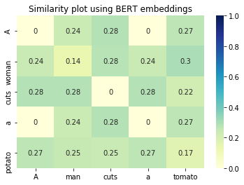
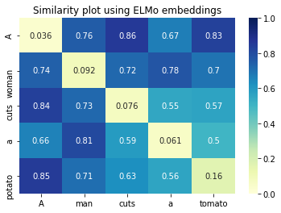
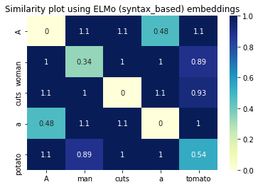
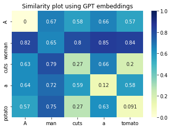

# Semantic word similarity

## Objective:
 To detect the robustness of word embeddings of different transfer learning models and semantic word aligning according to the models.
 
## Description:
 [BERT](https://arxiv.org/pdf/1810.04805.pdf)(Bi-directional encoding representations for transformer) and [ELMo](https://arxiv.org/pdf/1802.05365.pdf)(Embeddings for Language Modelling) are two transfer learning models which were pretrained with a huge corpus of text data. We can use the corresponding word embeddings from those models for various tasks by finetuning the ultimate layers.
  Here we tried to analyze the transfer learning models' embeddings and their role in semantics of the words. We also assign the similar words of second sentence for each word in the first sentence as a list.
 
## Procedure:
* Download the word embeddinlot on the right side reprgs of transfer learning models.(Currently BERT and ELMo)
* Input two different sentences.
* Tokenizing the sentences into words.
* Assigning the corresponding word embeddings of a transfer learning model.
* Calculating cosine similarity between the corresponding word embeddings.
* Plotting the similarity matrix.

## Frame works and libraries:
* NumPy
* Scipy
* NLTK
* Seaborn
* Matplotlib

* bert-embedding
* allennlp

## Example results:

   

* Note: The lighter the cell, the more similar the words are!!

## Observations
* ELMo is case sensitive. 'A' and 'a' are not equal in ELMo.
* As explained in the [paper](https://arxiv.org/pdf/1802.05365.pdf), the higher level LSTM embeddings of ELMo are highly sensitive to the context. This means that two equal words are not similar, when they are surrounded by different neighbouring words in different sentences.
* These high level features works better with polysemy.
* BERT is not case sensitive. It is not context sensitive either.
* GPT is also not a case sensitive, but is context sensitive.

## Future works:
* Analyzing the word embeddings of ULMFit, GPT-2 and XLNet.
* Analyzing the sentence embeddings.

